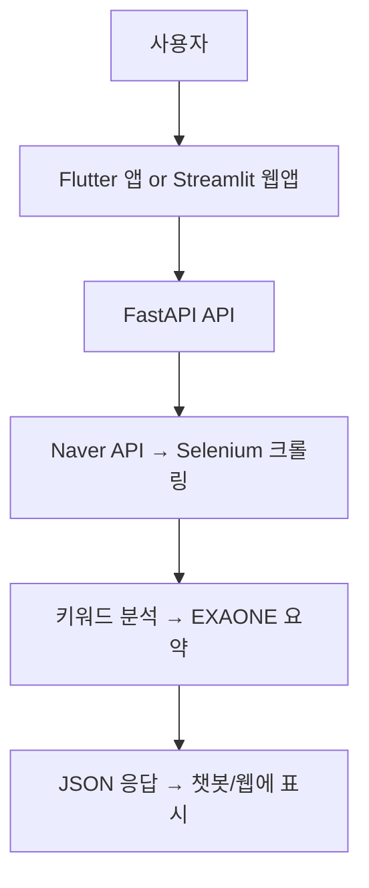

# 🧠 Barrier-Free Accessibility Chatbot

장소명을 입력하면 블로그 리뷰를 수집·분석하여  
휠체어 접근성(배리어프리 점수)을 예측하고  
챗봇 스타일로 정보를 알려주는 AI 기반 서비스입니다.

---

## 🚀 주요 기능

- 🔍 장소명 기반 리뷰 검색 (네이버 블로그 API)
- 🤖 키워드 마이닝으로 접근성 점수 계산
- 🧠 EXAONE 기반 요약 생성 (친절한 챗봇 스타일)
- 💾 캐싱 시스템 (중복 분석 방지)
- 📱 두 가지 모바일 앱 제공
  - WebView 앱 (Streamlit 웹앱을 감싸는 껍데기)
  - 채팅 UI 앱 (Flutter + FastAPI API 직접 호출)

---

## 🧱 시스템 아키텍처



---

## 📁 폴더 구조

barrierfree-project/
├── backend/                        # 🧠 FastAPI + Streamlit 서버
│   ├── app/
│   │   ├── main_with_cache.py          # FastAPI API 진입점
│   │   ├── crawler/
│   │   │   └── blog_crawler.py         # 블로그 본문 크롤링
│   │   ├── services/
│   │   │   ├── keyword_analysis.py     # 키워드 기반 점수 계산
│   │   │   └── summarizer.py           # EXAONE 요약 생성
│   │   ├── utils/
│   │   │   └── naver_api.py            # 네이버 검색 API 호출
│   │   ├── config.py                   # .env 설정 로더
│   │   └── cache/
│   │       └── accessibility_cache.db  # shelve 기반 캐시
│   ├── streamlit_app.py               # Streamlit 웹 UI
│   ├── .env                           # 네이버 API 키 (.gitignore 대상)
│   ├── requirements.txt               # Python 패키지 목록
│   └── README.md
│
├── mobile_app_webview/             # 📱 Flutter WebView 앱
│   ├── lib/
│   │   └── main.dart                   # WebView → Streamlit 연결
│   ├── android/                        # Android 설정 (권한 등)
│   ├── ios/                            # iOS 설정 (Info.plist 등)
│   └── pubspec.yaml
│
├── mobile_app_chat_ui/             # 💬 Flutter 채팅 UI 앱
│   ├── lib/
│   │   └── main.dart                   # 사용자 입력 → API 호출 → 챗봇 응답
│   └── pubspec.yaml
│
└── README.md                        # 프로젝트 설명 파일

---

## ⚙️ 실행 방법

### 🧠 1. 백엔드 API 서버 실행

```bash
cd backend
uvicorn app.main_with_cache:app --reload
```

### 🎨 2. Streamlit 앱 실행

```bash
streamlit run streamlit_app.py
```

### 📱 3. Flutter 앱 실행

▸ WebView 앱 실행

```bash
cd mobile_app_webview
flutter pub get
flutter run
```

▸ 채팅 UI 앱 실행

```bash
cd mobile_app_chat_ui
flutter pub get
flutter run
```

### 🌐 4. 외부 접근용 ngrok 실행 (선택)

```bash
ngrok http 8501
```

## 🔌 API 명세
GET /get_accessibility_score?place=장소명

### ✅ 성공 응답 예시

```json
{
  "place": "서울숲",
  "score": 87,
  "positive_keywords": ["유모차", "엘리베이터"],
  "negative_keywords": ["계단"],
  "review_samples": ["엘리베이터가 있어 휠체어 이동이 편리해요.", "계단이 거의 없어요."],
  "chat_style_summary": "서울숲은 휠체어나 유모차도 편리하게 이동할 수 있는 장소예요.",
  "from_cache": false
}
```

### ❌ 실패 응답 예시

```json
{
  "error": "리뷰를 찾을 수 없습니다."
}
```
